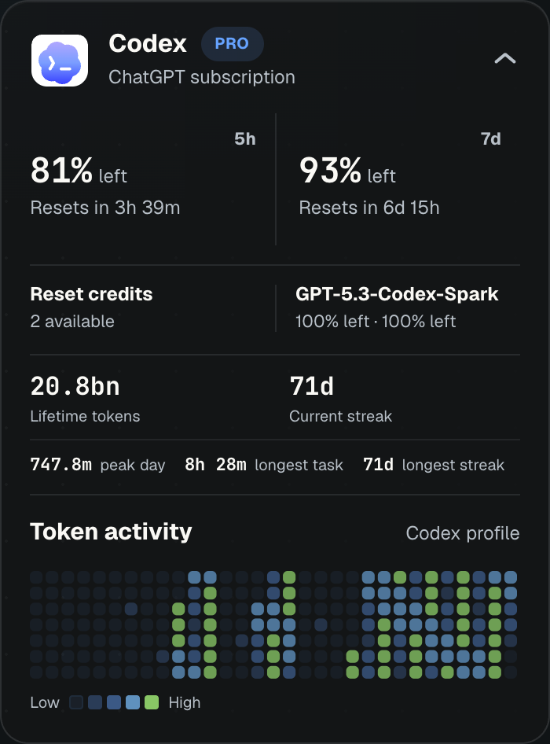

<div align="center">


# Burnmeter

**Track Claude and Codex subscription limits from one compact desktop panel.**

macOS · Linux · Windows

[**Download Latest Release**](https://github.com/hacksurvivor/burnmeter/releases/latest)

---



</div>

## Download

> **Note:** packaged releases may lag behind `main`. Build from source for the newest Claude + Codex UI.

Burnmeter reads local subscription sessions. Sign in with the tools you use:

- [Claude Code](https://claude.ai/code) with `claude login`, or [Claude Desktop](https://claude.ai/download)
- [Codex CLI](https://developers.openai.com/codex) with `codex login`

| Platform | Download |
|----------|----------|
| macOS (Apple Silicon) | [`.dmg`](https://github.com/hacksurvivor/burnmeter/releases/latest) |
| macOS (Intel) | [`.dmg`](https://github.com/hacksurvivor/burnmeter/releases/latest) |
| Windows | [`.msi`](https://github.com/hacksurvivor/burnmeter/releases/latest) |
| Linux | [`.deb` / `.AppImage`](https://github.com/hacksurvivor/burnmeter/releases/latest) |

## Features

- Real-time **5-hour** and **7-day** subscription windows for Claude and Codex
- Collapsible provider cards so multiple subscriptions fit in the same panel
- Provider-specific boost tracking for off-peak promos, reset credits, and higher temporary limits
- Local token activity heatmaps with lifetime usage, peak day, longest task, and streak stats
- Settings panel for connected, missing, limited, or offline Claude/Codex accounts
- Menu bar status summarizing the tightest remaining provider limit

## How it works

1. Reads local OAuth/subscription credentials from Claude Code, Claude Desktop, or Codex CLI — **read-only**
2. Polls provider usage endpoints every 60 seconds
3. Keeps failed or disconnected Claude/Codex accounts in Settings instead of crowding the main page
4. Aggregates local Claude and Codex history for activity heatmaps
5. Shows reset times, extra usage windows, and active provider boosts in your local timezone

## Extra Usage Windows

Claude and Codex can expose temporary higher limits, reset credits, or off-peak multipliers. Burnmeter models those as provider boosts so the main usage card can show both the normal limits and any extra capacity currently available.

Claude off-peak periods and Codex model-specific limits appear in the same boost area when available from the provider or local history.

## Tech stack

[Tauri v2](https://tauri.app/) · Rust · React · TypeScript · Vite

## Build from source

```bash
curl --proto '=https' --tlsv1.2 -sSf https://sh.rustup.rs | sh
source ~/.cargo/env

git clone https://github.com/hacksurvivor/burnmeter.git
cd burnmeter
pnpm install
pnpm tauri build
```

Requires: Rust, Node.js 20+, pnpm.

## Contributing

PRs welcome.

## License

[MIT](LICENSE)
