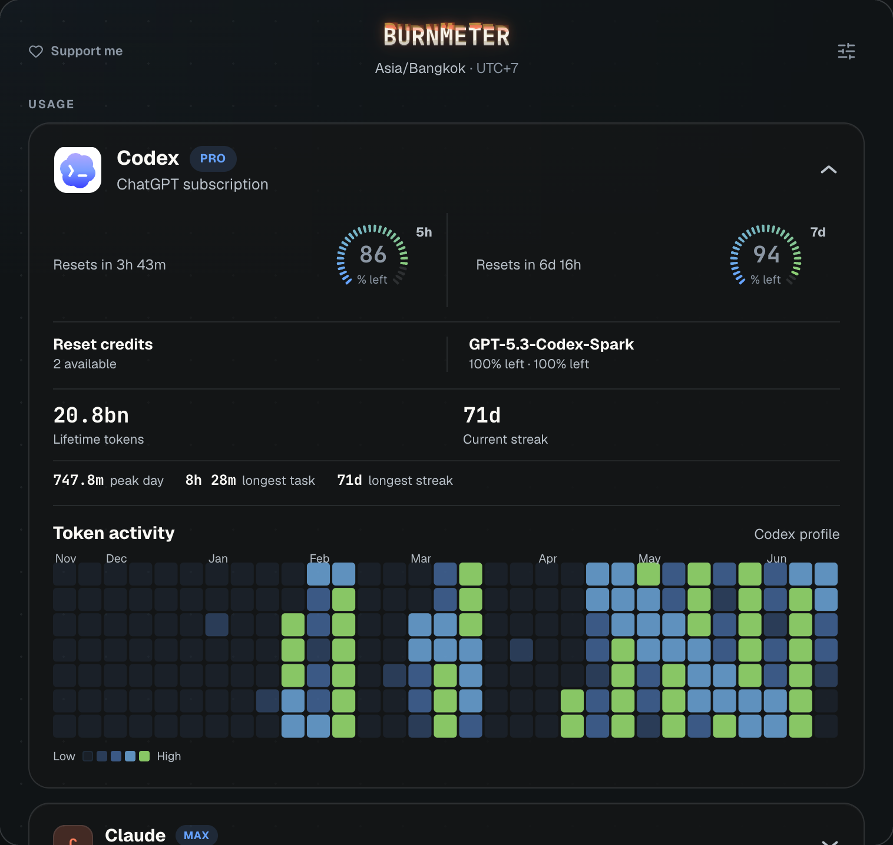

<div align="center">


# Burnmeter

**Track your Claude usage and the 2x promotion — right from your menu bar.**

macOS · Linux · Windows

[**Download Latest Release**](https://github.com/hacksurvivor/burnmeter/releases/latest)

---



</div>

## Download

> **Requires:** [Claude Code](https://claude.ai/code) with `claude login` completed first.

| Platform | Download |
|----------|----------|
| macOS (Apple Silicon) | [`.dmg`](https://github.com/hacksurvivor/burnmeter/releases/latest) |
| macOS (Intel) | [`.dmg`](https://github.com/hacksurvivor/burnmeter/releases/latest) |
| Windows | [`.msi`](https://github.com/hacksurvivor/burnmeter/releases/latest) |
| Linux | [`.deb` / `.AppImage`](https://github.com/hacksurvivor/burnmeter/releases/latest) |

## Features

- **FREE 2x / PEAK** status with countdown timer
- Real-time **5-hour** and **7-day** usage percentages from Anthropic's API
- Automatic timezone detection — peak hours in your local time
- Weekend detection — all day 2x bonus on weekends
- Menu bar shows `🟢 FREE 2x · 84%` or `🟠 PEAK · 84%` at a glance
- Right-click to quit

## How it works

1. Reads your Claude Code OAuth token (macOS Keychain / Linux+Windows credentials file) — **read-only**
2. Polls `api.anthropic.com/api/oauth/usage` every 60s
3. Calculates peak/off-peak from IANA `America/Los_Angeles`
4. Converts to your local timezone automatically

## Promotion details

**March 13–27, 2026** — Anthropic doubles usage during off-peak hours:

| | Hours (Pacific) | Your tokens |
|---|---|---|
| **Peak** | 5–11 AM, weekdays | Standard rate |
| **Off-peak** | Everything else + weekends | 2x bonus |

Eligible: Free, Pro, Max, Team plans.

## Tech stack

[Tauri v2](https://tauri.app/) · Rust · React · TypeScript · Vite

## Build from source

```bash
curl --proto '=https' --tlsv1.2 -sSf https://sh.rustup.rs | sh
source ~/.cargo/env

git clone https://github.com/hacksurvivor/burnmeter.git
cd burnmeter
pnpm install
pnpm tauri build
```

Requires: Rust, Node.js 20+, pnpm.

## Contributing

PRs welcome.

## License

[MIT](LICENSE)
