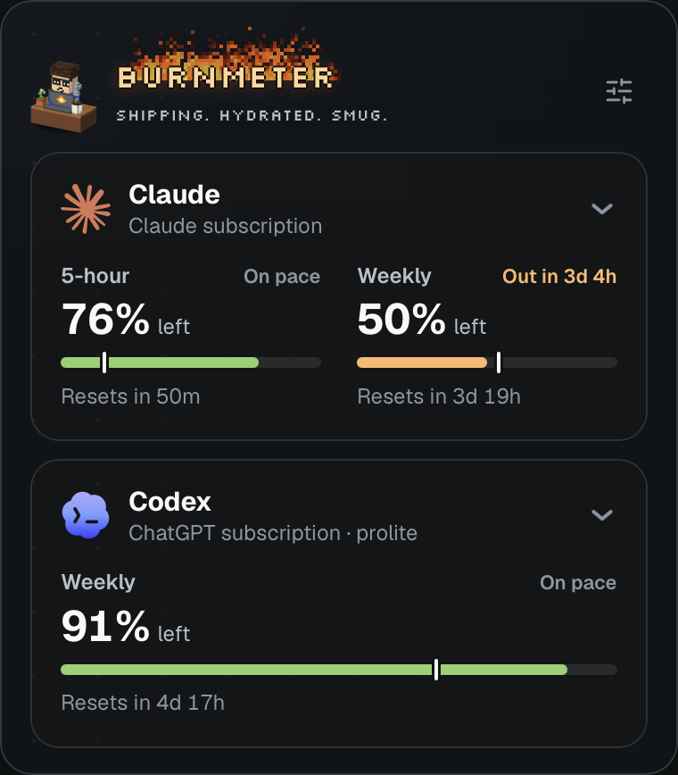

<div align="center">


# Burnmeter

**Track Claude and Codex subscription limits from one compact desktop panel.**

macOS · Linux · Windows

[**Download Latest Release**](https://github.com/hacksurvivor/burnmeter/releases/latest)

---



</div>

## Download

Burnmeter reads local subscription sessions. Sign in with the tools you use:

- [Claude Code](https://claude.ai/code) with `claude login`, or [Claude Desktop](https://claude.ai/download)
- [Codex CLI](https://developers.openai.com/codex) with `codex login`

Open the [latest release](https://github.com/hacksurvivor/burnmeter/releases/latest) and choose:

| Platform | Pick this asset |
|----------|-----------------|
| macOS Apple Silicon (M1/M2/M3/M4) | `Burnmeter-...-macOS-Apple-Silicon.dmg` |
| macOS Intel | `Burnmeter-...-macOS-Intel.dmg` |
| Windows x64 | `Burnmeter-...-Windows-x64-setup.exe` |
| Windows x64 MSI | `Burnmeter-...-Windows-x64.msi` |
| Linux x64 AppImage | `Burnmeter-...-Linux-x64.AppImage` |
| Linux x64 Debian/Ubuntu | `Burnmeter-...-Linux-x64.deb` |
| Linux x64 Fedora/RHEL | `Burnmeter-...-Linux-x64.rpm` |

The macOS `auto-update.app.tar.gz` assets are for updater clients, not normal manual installs.

## Features

- Real-time **5-hour** and **weekly** subscription windows for Claude and Codex
- A wordmark that **catches fire** as you burn through your tightest limit, and a mascot that goes from smug to skeleton: pick the Matchstick, the Burnout dev, or the Wallet, in voxel or 8-bit
- **Pace check** on every limit: an even-pace marker, plus a warning when you'll run out before the reset
- Both providers visible at a glance; expand a card for stats and history
- Provider-specific boost tracking for off-peak promos, reset credits, and higher temporary limits
- Token activity heatmaps with lifetime usage, peak day, longest session, and streak stats
- Settings panel for connected, missing, limited, or offline Claude/Codex accounts
- Menu bar percentage for Claude, Codex, or both in rotation

## How it works

1. Reads local OAuth/subscription credentials from Claude Code, Claude Desktop, or Codex CLI — **read-only**
2. Polls provider usage endpoints every 60 seconds
3. Keeps failed or disconnected Claude/Codex accounts in Settings instead of crowding the main page
4. Aggregates local Claude and Codex history for activity heatmaps
5. Shows reset times, extra usage windows, and active provider boosts in your local timezone

## Extra Usage Windows

Claude and Codex can expose temporary higher limits, reset credits, or off-peak multipliers. Burnmeter models those as provider boosts so the main usage card can show both the normal limits and any extra capacity currently available.

Claude off-peak periods and Codex model-specific limits appear in the same boost area when available from the provider or local history.

## Tech stack

[Tauri v2](https://tauri.app/) · Rust · React · TypeScript · Vite

## Build from source

```bash
curl --proto '=https' --tlsv1.2 -sSf https://sh.rustup.rs | sh
source ~/.cargo/env

git clone https://github.com/hacksurvivor/burnmeter.git
cd burnmeter
pnpm install
pnpm tauri build
```

Requires: Rust, Node.js 20+, pnpm.

Mascot frames in `src/assets/mascots/` are rendered from the voxel models in `scripts/mascots/`. After editing a model, regenerate them with `pnpm mascots:render` (needs Google Chrome).

## Contributing

PRs welcome.

## License

[MIT](LICENSE)
